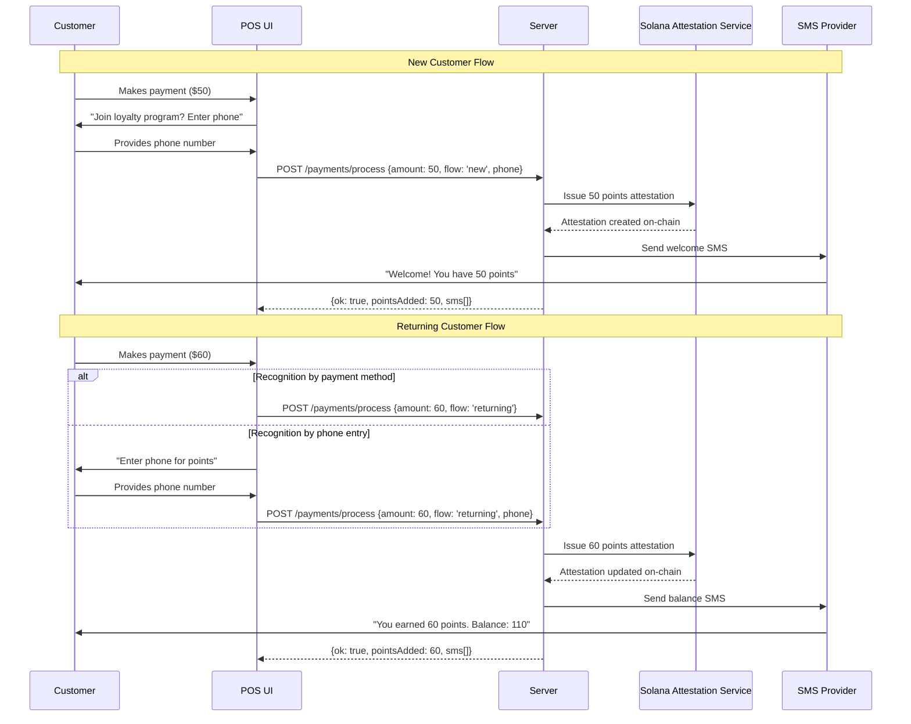
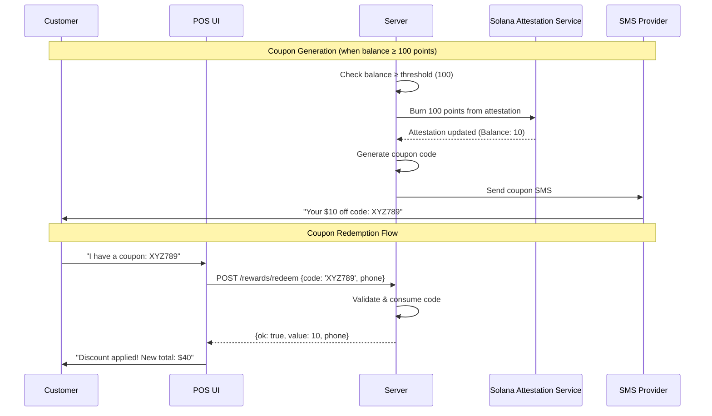

# SAS Loyalty Starter (Solana Attestation Service + SMS)

Tiny starter for issuing loyalty **points** and demoing **VIP tier** via Solana Attestation Service (SAS), with a clean SMS interface behind a pluggable provider (Twilio adapter included, stub enabled by default). **No databases**—simple, open-source starter.

## Features
- **Server**
  - `POST /rewards/issue` — issue points via SAS (**mock by default**) and send SMS
  - `GET /rewards/:phone` — read balance/history (from SAS mock or SDK when wired)
  - `POST /rewards/redeem` — redeem a code for a discount (deducts up to the order total, no negative totals)
  - Pluggable `SmsProvider`: `stub` (default) or `twilio`
  - `SasClient`: `mock` (default) with typed interface; swap in real SAS SDK integration
  - Simple in-memory redemption codes for demo
- **Web**
  - Vite + React + TS
  - Two pages with left side-drawer:
    - **Payments + Issuance** (new/returning + redemption)
      - New / Returning customer buttons
      - Pay & Distribute button
      - Redemption code input + Redeem button (applies discount up to order total, no negative totals)
      - **Helper panel** on the right with a one-sentence explanation for each button
      - Example branded points name in SMS confirmations (from **Setup Attestations** page)
    - **Setup Attestations** (Punchcard configurable; Tier lines visible/demo-only)
    - **Redemption Flow**: Handles discount application and ensures no negative totals.
      - Configure points name, punchcard, and tier lines (read-only demo in starter)
- **Env**
  - `.env.example` provided; never commit secrets.
  - `USE_MOCK_SAS=true|false` to toggle between mock mode and real SAS on Devnet

> This is a **starter**: the SAS client uses a mock in-memory implementation. Flip to real SDK once ready.

---

## Prereqs
- Node 18+ and PNPM or NPM/Yarn
- (Optional) Twilio account if you want real SMS
- (Optional) Solana CLI for keypair on **Devnet**

### Create a Devnet keypair (example)
```bash
solana-keygen new -o ~/.config/solana/id.json
solana config set --url https://api.devnet.solana.com
```

---

## Setup

### 1) Server
```bash
cd server
pnpm i        # or npm i / yarn
cp ../.env.example .env
pnpm dev      # starts on http://localhost:4000
```

### 2) Web
```bash
cd ../web
pnpm i
pnpm dev      # opens http://localhost:5173
```

---

## Environment (.env)
See `.env.example` for all keys. By default, **stub** SMS + **mock** SAS are used.

```
SMS_PROVIDER=stub
USE_MOCK_SAS=true
```

To send real SMS:
```
SMS_PROVIDER=twilio
TWILIO_ACCOUNT_SID=...
TWILIO_AUTH_TOKEN=...
TWILIO_FROM=+1XXXXXXXXXX
```

To use real SAS on Devnet:
```
USE_MOCK_SAS=false
```
…and provide your Solana keypair in .env as needed.

To keep using stubs, leave `SMS_PROVIDER=stub` (default).

---

## Swap in real SAS
See `server/src/services/sas.ts`. Replace the mock with calls to the **Solana Attestation Service** SDK/client:
- `issuePointsAttestation(phone, points, metadata)`
- `getAttestations(phone)`

Keep the interface; replace the internals.

---

## How It Works

### New Customer Flow
1. Customer makes payment at POS
2. POS prompts for phone number to join loyalty program
3. Server creates wallet and issues points attestation via SAS
4. Customer receives welcome SMS with points balance
5. If points reach threshold, coupon code is generated and sent via SMS

### Returning Customer Flow
1. Customer makes payment at POS (identified by payment method OR phone number entry)
2. Server issues points attestation via SAS based on purchase amount
3. Customer receives SMS with updated points balance
4. If points reach threshold, coupon code is generated and sent via SMS

### Redemption Flow
1. Customer enters coupon code at POS
2. Server validates and consumes the code
3. Discount is applied to current order (up to order total, no negative totals)

### Customer Onboarding & Points Earning
This diagram shows how customers join the program and earn points through purchases.



### Coupon Generation & Redemption
This diagram shows how coupons are generated when thresholds are met and how they're redeemed.



---

## Screenshots

### Payments Page


### Setup Attestations Page


---

## Notes
- No DB by design. In-memory demo state resets on server restart.
- Privy wallet creation is **stubbed**; see `server/src/services/customers.ts`.
- Tier program UI is visible but **read-only** example in this starter.
- MIT License.
